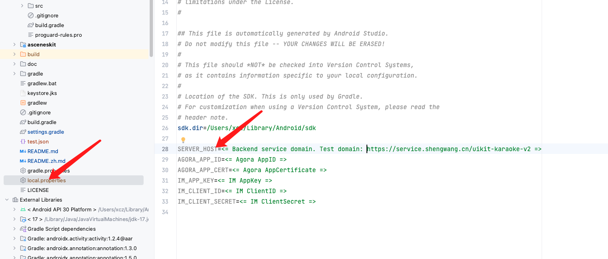

# AUIKaraoke-Android Quick Start

*English | [中文](README.zh.md)*

This document mainly introduces how to quickly run through the AUIKaraoke example  and experience online karaoke scenarios, including micseat service, user service, music service, song player service, etc. For a more detailed introduction, please refer to  [AUIKit](https://github.com/AgoraIO-Community/AUIKit/blob/main/Android/README.md)

## Architecture


## Directory

```
.
├── app                                       				            // Demo
└── asceneskit																				
    └── src
        └── main
            ├── java
            │   └── io.agora.asceneskit.karaoke				
            │       ├── AUIKaraokeRoomService.kt	    // Room service, manage AUIKit services 
            │       ├── KaraokeRoomView.kt            // Room UI，manage AUIKit UI components
            │       ├── KaraokeUiKit.kt           	// Karaoke launch class
            │       └── binder
            │           ├── AUIChatBottomBarBinder.kt	// The binder of bottom bar UI and services
            │           ├── AUIChatListBinder.kt		// The binder of chat list UI and services
            │           ├── AUIGiftBarrageBinder.kt	// The binder of gift UI and services
            │           ├── AUIJukeboxBinder.java 	// The binder of jukebox UI and services
            │           ├── AUIMicSeatsBinder.java	// The binder of micseats UI and services
            │           ├── AUIMusicPlayerBinder.java	// The binder of music player UI and services
            │           └── IAUIBindable.java
            ├── res
            └── res-ktv
```


## Requirements

- <mark>Minimum Compatibility with Android 7.0</mark>（SDK API Level 24）
- Android Studio 3.5 and above versions.
- Mobile devices with Android 7.0 and above.
- JDK 17.

## Getting Started

### 1. Obtain Agora AppID and AppCertificate

- Login to [Agora Console](https://console.shengwang.cn/)，register one if no account.

- Create project

  

  

- Copy agora AppID and AppCertificate

  

  


### 2. Obtain IM AppKey、ClientID和ClientSecret

- Login [IM Console](https://console.easemob.com/)，register one if no account.

- Create a application.

  

- Enter application detail page，then copy IM AppKey、ClientID and ClientSecret

  

### 3. (Optional)Deploying Karaoke backend services

- [Deploying Karaoke backend services](../backend/README_zh.md) 
- Obtain backend services host

> If not deployed, you can use the test domain：https://service.shengwang.cn/uikit-karaoke-v2

### 4. Configure and run

- Clone or directly download the project source code

- Configure the obtained agora AppID, agora AppCertificate, IM AppKey, IM Client ID, IM Client Secret, and backend service host url in the local. properties (manually created if not present) of the Android project root directory

  


- Open the Android project with Android Studio to start your experience.

## Quick integration
Please review [KaraokeUIKit](./doc/KaraokeUIKit.md)

## FAQ

- [FAQ](./doc/KaraokeFAQ.md)

- If you have any other questions, please feedback to the [developer community](

## License

Copyright © Agora Corporation. All rights reserved.
Licensed under the [MIT license](LICENSE).