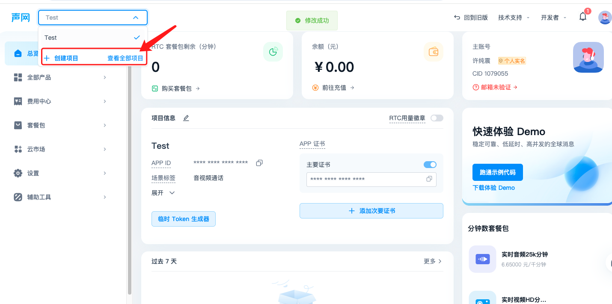
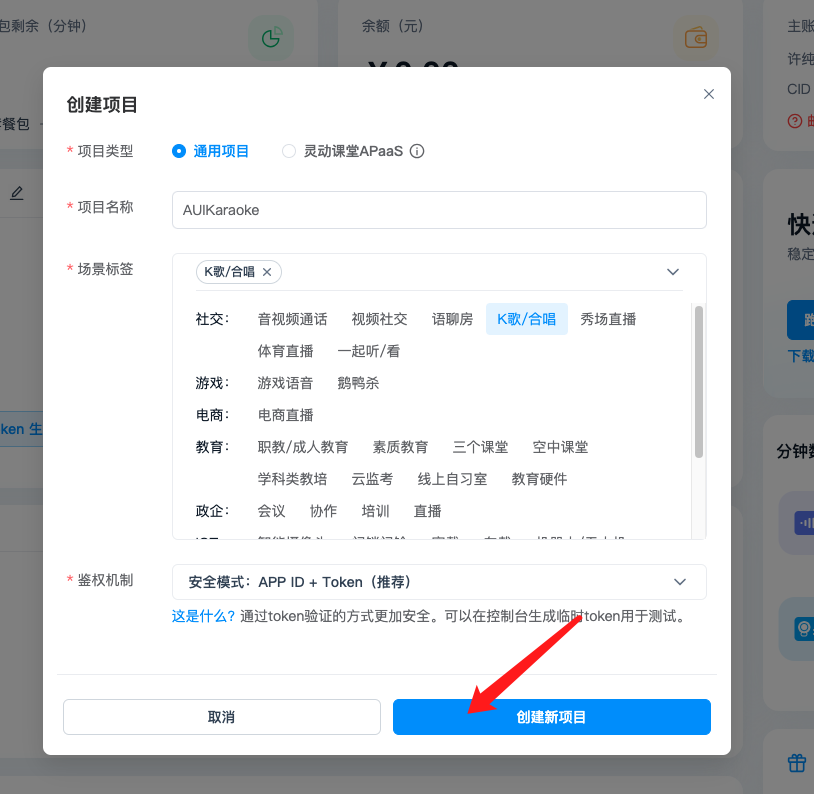
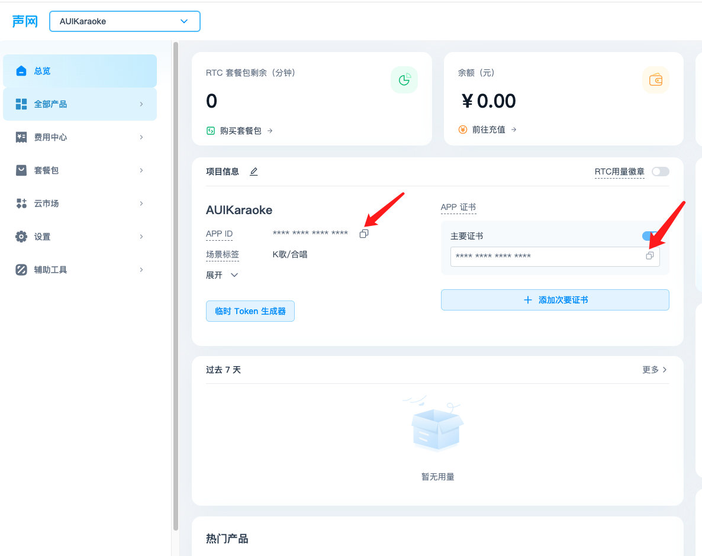
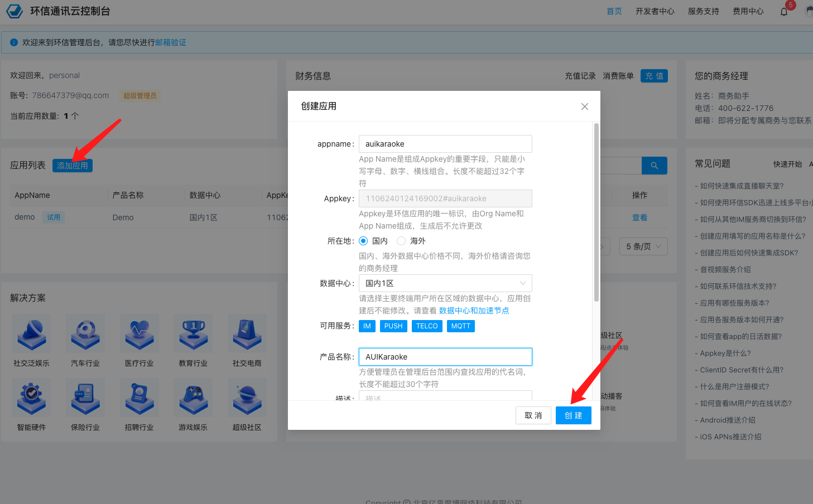
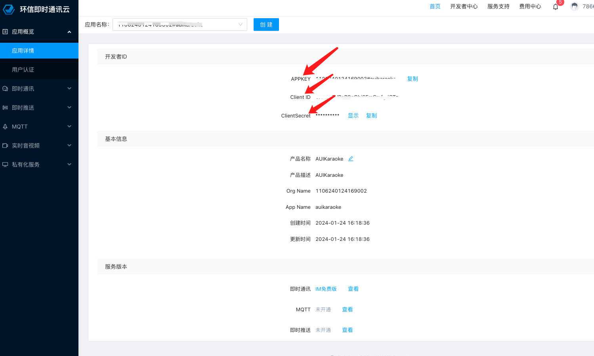
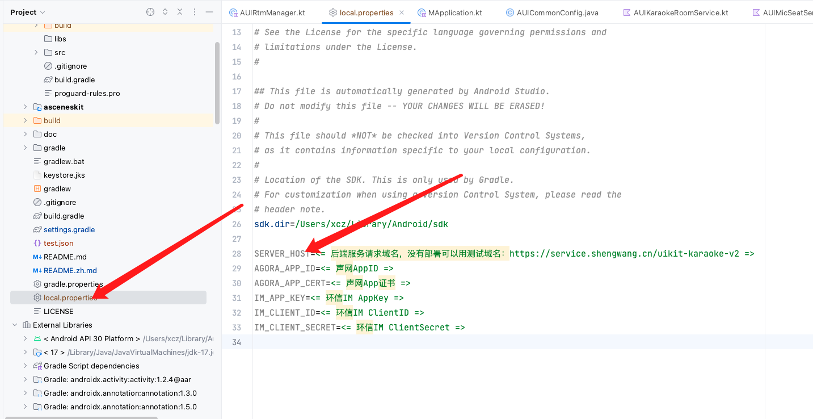

# AUIKitKaraoke Android 示例工程快速跑通

*[English](README.md) | 中文*

本文档主要介绍如何快速跑通 AUIKaraoke 示例工程，体验在线 K 歌场景，包括麦位管理、用户管理、歌曲管理、歌曲播放等，更详细的介绍，请参考[AUIKit](https://github.com/AgoraIO-Community/AUIKit/blob/main/Android/README.zh.md)


## 架构图


## 目录结构

```
.
├── app                                       				// Demo
└── asceneskit																				
    └── src
        └── main
            ├── java
            │   └── io.agora.asceneskit.karaoke				
            │       ├── AUIKaraokeRoomService.kt	    // 房间服务，管理AUIKit各个Service
            │       ├── KaraokeRoomView.kt            // 房间UI，管理AUIKit各个UI组件
            │       ├── KaraokeUiKit.kt           	// K歌入口类
            │       └── binder
            │           ├── AUIChatBottomBarBinder.kt	// 底部栏UI和service的绑定者
            │           ├── AUIChatListBinder.kt		// 聊天UI和service的绑定者
            │           ├── AUIGiftBarrageBinder.kt   // 礼物UI和service的绑定者
            │           ├── AUIJukeboxBinder.java 	// 点歌器UI和service的绑定者
            │           ├── AUIMicSeatsBinder.java	// 麦位UI和service的绑定者
            │           ├── AUIMusicPlayerBinder.java	// 播放器UI和service的绑定者
            │           └── IAUIBindable.java
            ├── res
            └── res-ktv
```


## 环境准备

- <mark>最低兼容 Android 7.0</mark>（SDK API Level 24）
- Android Studio 3.5及以上版本。
- Android 7.0 及以上的手机设备。
- JDK 17

## 运行示例

### 1. 获取声网AppID和证书

- 登录[声网控制台](https://console.shengwang.cn/)，如果没有账号则注册一个

- 创建项目

  

  

- 复制AppID和证书，并保存下来

  

  


### 2. 获取环信IM AppKey、ClientID和ClientSecret

- 登录[环信即时通讯控制台](https://console.easemob.com/)，如果没有账号则创建一个

- 点击添加并创建应用

  

- 点击查看进入应用详情页，复制AppKey、ClientID和ClientSecret，并保存下来

  

### 3. （可选）一键部署Karaoke后端服务

- [部署Karaoke后端服务](../backend/README_zh.md) 
- 获取后端服务请求域名，并保存下来

> 如果没有部署，可以用声网提供的测试域名：https://service.shengwang.cn/uikit-karaoke-v2

### 4. 配置并运行项目

- 克隆或者直接下载项目源码

- 在Android项目根目录的local.properties（如果不存在则手动创建）里配置上面获取得的声网AppID、声网App证书、环信IM AppKey、环信IM Client ID、环信IM Client Secret 和 后端服务请求域名

  


- 用 Android Studio 打开Android项目即可开始您的体验

## 快速集成

请查看[KaraokeUIKit](./doc/KaraokeUIKit.zh.md)

## 常见问题

- [常见问题](./doc/KaraokeFAQ.zh.md)
- 如有其他问题请反馈至 [开发者社区](https://www.rtcdeveloper.cn/cn/community/discussion/0)

## 许可证
版权所有 Agora, Inc. 保留所有权利。
使用 [MIT 许可证](LICENSE)
